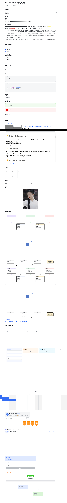
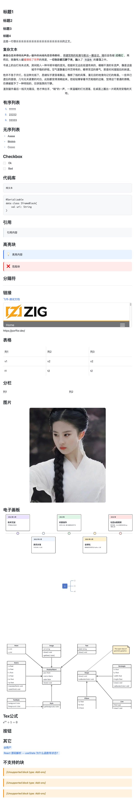

# Feishu2HTML

[](https://kotlinlang.org)
[](https://opensource.org/licenses/MIT)
[](https://gradle.org)
[](https://yidafu.github.io/feishu2html/)
[](https://kotlinlang.org/docs/multiplatform.html)

A powerful **Kotlin Multiplatform** library and CLI tool to convert Feishu (Lark) documents to beautiful, standalone HTML files.

**🌐 Now supports JVM, JS, and Native platforms!**

> 📖 **[View API Documentation](https://yidafu.github.io/feishu2html/)** - Complete KDoc reference

## ✨ Features

- 🌐 **Kotlin Multiplatform** - Runs on JVM, JS (Node.js/Browser), and Native platforms
- 🎯 **Comprehensive Block Support** - All major Feishu document block types (headings, paragraphs, lists, tables, code blocks, etc.)
- 📦 **Resource Management** - Automatic download and save of images and attachments
- 🎨 **Rich Text Formatting** - Full support for text styles (bold, italic, underline, strikethrough, links, etc.)
- 🧮 **Math Rendering** - Mathematical formulas powered by MathJax
- 💻 **Syntax Highlighting** - Code blocks with 70+ language support
- 🔧 **Flexible Usage** - Use as library or CLI tool (JVM)
- ⚡ **Async Downloads** - Asynchronous resource downloading for better performance
- 🛡️ **Type Safety** - Type-safe HTML generation using kotlinx.html DSL
- 🎭 **Clean Architecture** - Elegant Renderer delegation pattern
- 🚀 **Cross-Platform** - >95% code shared across all platforms

## 🎨 Visual Comparison

Feishu2HTML faithfully recreates the original styling and layout. Side-by-side comparison:

<table>
  <tr>
    <th align="center">Feishu Online</th>
    <th align="center">Local HTML Output</th>
  </tr>
  <tr>
    <td></td>
    <td></td>
  </tr>
</table>

The generated HTML preserves typography, colors, layout, and all media content with 100% authentic Feishu appearance.

## 📋 Table of Contents

- [✨ Features](#-features)
- [🎨 Visual Comparison](#-visual-comparison)
- [🚀 Quick Start](#-quick-start)
- [📚 Usage Guides](#-usage-guides)
- [🌐 Multiplatform Support](#-multiplatform-support)
- [🔍 Getting Document ID](#-getting-document-id)
- [🔧 Troubleshooting](#-troubleshooting)
- [⚠️ Known Limitations](#️-known-limitations)
- [📊 Supported Block Types](#-supported-block-types)
- [📖 API Documentation & References](#-api-documentation--references)
- [📄 License](#-license)
- [🤝 Contributing](#-contributing)

## 🚀 Quick Start

### Prerequisites

- **JVM**: JDK 17+, Gradle 8.0+ (or use included wrapper)
- **JS**: Node.js 16+ (browser not supported)
- **Native**: Platform toolchain (XCode/GCC/MinGW)

### 1. Get Feishu App Credentials

1. Visit [Feishu Open Platform](https://open.feishu.cn/app)
2. Create a self-built app
3. Get your `App ID` and `App Secret`
4. Add the following permissions to your app:
   - `docx:document` - View, comment, and export documents
   - `drive:drive` - View and download files in cloud storage

### 2. Grant Document Access

**Important**: You must grant your app access to the documents you want to export:

1. Open the Feishu document you want to export
2. Click the "Share" button in the top-right corner
3. Add your app/bot to the document collaborators
4. Grant at least "View" permission

**⚠️ Limitation**: If your document contains embedded/referenced external documents (e.g., via links or iframe blocks), you must also grant your app access to those external documents. Otherwise, the content may fail to load or appear as broken links.

### 3. CLI Usage

```bash
# Clone the repository
git clone https://github.com/yidafu/feishu2html.git
cd feishu2html

# Build the project
./gradlew build

# Export a single document
./gradlew run --args="<app_id> <app_secret> <document_id>"

# Export multiple documents
./gradlew run --args="<app_id> <app_secret> <doc_id_1> <doc_id_2> <doc_id_3>"
```

**Example:**
```bash
./gradlew run --args="cli_a1234567890abcde your_app_secret_here doxcnABC123XYZ456"
```

Output files will be saved to `./output/` directory by default.

### 4. Library Usage

#### Add to Your Project

**Kotlin Multiplatform Project:**

```kotlin
kotlin {
    sourceSets {
        val commonMain by getting {
            dependencies {
                implementation("dev.yidafu.feishu2html:feishu2html:1.0.0")
            }
        }
    }
}
```

**JVM-only Project:**

```kotlin
dependencies {
    implementation("dev.yidafu.feishu2html:feishu2html-jvm:1.0.0")
}
```

**JS Project:**

```kotlin
dependencies {
    implementation("dev.yidafu.feishu2html:feishu2html-js:1.0.0")
}
```

#### Basic Example

```kotlin
import dev.yidafu.feishu2html.Feishu2Html
import dev.yidafu.feishu2html.Feishu2HtmlOptions
import kotlinx.coroutines.runBlocking

fun main() = runBlocking {
    val options = Feishu2HtmlOptions(
        appId = "your_app_id",
        appSecret = "your_app_secret"
    )

    // Use .use {} for automatic resource management
    Feishu2Html(options).use { converter ->
        converter.export("doxcnABC123XYZ456")
        println("Export completed successfully!")
    }
}
```

#### Advanced Example with Custom Options

```kotlin
import dev.yidafu.feishu2html.Feishu2Html
import dev.yidafu.feishu2html.Feishu2HtmlOptions
import kotlinx.coroutines.runBlocking

fun main() = runBlocking {
    val options = Feishu2HtmlOptions(
        appId = "your_app_id",
        appSecret = "your_app_secret",
        outputDir = "./output",          // HTML output directory
        imageDir = "./output/images",    // Image save directory
        fileDir = "./output/files",      // Attachment save directory
        imagePath = "images",            // Relative path for images in HTML
        filePath = "files",              // Relative path for files in HTML
        customCss = null                 // Custom CSS (optional)
    )

    // Automatic resource cleanup with use {}
    Feishu2Html(options).use { converter ->
        // Batch export multiple documents
        val documentIds = listOf(
            "doxcnABC123XYZ456",
            "doxcnDEF789GHI012",
            "doxcnJKL345MNO678"
        )
        
        converter.exportBatch(documentIds)
        println("Batch export completed!")
    }
}
```

### 5. CSS Styling Options

#### Using Official Feishu Styles (Default)

By default, exported HTML uses an optimized version extracted from official Feishu CSS:

```kotlin
val options = Feishu2HtmlOptions(
    appId = "your_app_id",
    appSecret = "your_app_secret",
    externalCss = true,                        // Use external CSS file (default)
    cssFileName = "feishu-style-optimized.css" // Optimized CSS (default, 16KB)
)

Feishu2Html(options).use { converter ->
    converter.export("document_id")
}
// Output: 
//   - document.html (with <link> to CSS)
//   - feishu-style-optimized.css (optimized styles, only 16KB!)
```

**Why Optimized CSS?** 98.4% smaller (16KB vs 1MB), faster load times, only needed selectors, 100% authentic appearance.

#### Inline CSS Mode

Use inline CSS for single-file portability (no separate CSS file):

```kotlin
val options = Feishu2HtmlOptions(
    appId = "your_app_id",
    appSecret = "your_app_secret",
    externalCss = false  // Embed CSS in <style> tag
)
```

#### Custom CSS Styling

Override with your own CSS (requires inline mode):

```kotlin
val customCss = """
    .protyle-wysiwyg { font-family: "Inter", sans-serif; }
    .heading-h1 { color: #2c3e50; border-bottom: 3px solid #3498db; }
    /* Add more custom styles... */
""".trimIndent()

val options = Feishu2HtmlOptions(
    appId = "your_app_id",
    appSecret = "your_app_secret",
    externalCss = false,  // Must use inline mode
    customCss = customCss
)
```

## 📚 Usage Guides

Detailed platform-specific usage guides:

- **[JVM Usage Guide](docs/jvm-usage.md)** - Complete guide for JVM platform (CLI & Library)
- **[Node.js Usage Guide](docs/nodejs-usage.md)** - ES Module setup and usage

## 🌐 Multiplatform Support

Feishu2HTML is built with **Kotlin Multiplatform**, enabling it to run on multiple platforms from a single codebase.

### Supported Platforms

| Platform | Status | Notes |
|----------|--------|-------|
| **JVM** | ✅ Production Ready | Full features (Library + CLI) |
| **JS (Node.js)** | ✅ Fully Supported | Core library features |
| **Native (macOS)** | 🔄 Experimental | Core library features |
| **Native (Linux x64)** | 🔄 Experimental | Core library features |
| **Native (Windows x64)** | 🔄 Experimental | Core library features |
| **iOS** | 🔄 Experimental | Core library features |

### Platform-Specific Notes

- **JVM**: Full support including CLI tool, Logback logging, and complete file I/O
- **JS (Node.js)**: File system via Node.js fs module, Ktor client, browser not supported  
- **Native**: POSIX file I/O, platform-specific HTTP engines (Darwin/Curl)

### Build Targets

Build for specific platforms:

```bash
# JVM
./gradlew compileKotlinJvm
./gradlew jvmJar

# JS
./gradlew compileKotlinJs
./gradlew jsJar

# Native (macOS ARM64)
./gradlew compileKotlinMacosArm64

# All platforms
./gradlew build
```

### Platform-Specific Usage

All platforms use the same API (see [Library Usage](#4-library-usage) for examples):
- **JVM**: Use `runBlocking` coroutine scope
- **JS (Node.js)**: Use `GlobalScope.promise` for async execution
- **Native**: Use `runBlocking` coroutine scope

## 🔍 Getting Document ID

The document ID can be extracted from the Feishu document URL:

```
https://example.feishu.cn/docx/doxcnABC123XYZ456
                              └─────────────────┘
                                 Document ID
```

For example:
- URL: `https://company.feishu.cn/docx/TPDddjY5foJZ8axlf9fctf2Wnse`
- Document ID: `TPDddjY5foJZ8axlf9fctf2Wnse`

## 🔧 Troubleshooting

### 1. Token Acquisition Failure

**Error**: `Failed to get token: app access token invalid`

**Solutions**:
- Verify `app_id` and `app_secret` are correct
- Ensure the app is enabled and published
- Check app permissions are configured

### 2. Document Access Failure

**Error**: `Failed to get document content: no permission`

**Solutions**:
- Confirm app has required permissions
- Ensure document is accessible to the app
- Try adding the app to document collaborators

### 3. Image Download Failure

**Solutions**:
- Check network connection
- Confirm app has `drive:drive` permission
- Some legacy documents may have API limitations

## ⚠️ Known Limitations

### 1. External Document References

When a Feishu document contains references to other documents (e.g., embedded documents, links to other docs), you must grant your app access to **all referenced documents** as well. The tool cannot automatically propagate permissions.

**Workaround**: Manually share each referenced document with your app before exporting.

### 2. Real-time Collaboration Content

Content from real-time collaboration features (e.g., comments, suggestions) is not included in the export.

### 3. Unsupported Block Types

Some advanced block types are not yet supported (ISV, Mindnote, Sheet, Task, OKR, Wiki Catalog, Agenda, Link Preview, etc.). These will display a placeholder message: `[暂不支持的Block类型: XXX]`

See the [Supported Block Types](#-supported-block-types) table for a complete list.

### 4. API Rate Limiting

The Feishu API has rate limits. The tool includes built-in rate limiting (QPS=2) to avoid exceeding limits, but very large documents may take time to process.

## 📖 API Documentation & References

### API Documentation

Complete API documentation is automatically generated and published to GitHub Pages:

**🔗 [View Online API Documentation](https://yidafu.github.io/feishu2html/)**

The documentation is automatically updated on every push to the `main` branch.

### Platform-Specific Guides

- [JVM Usage Guide](docs/jvm-usage.md) - Detailed JVM platform guide
- [Node.js Usage Guide](docs/nodejs-usage.md) - Node.js / JavaScript guide

### Feishu API References

- [Feishu Open Platform Docs](https://open.feishu.cn/document/home/index)
- [Document Block API](https://open.feishu.cn/document/server-docs/docs/docs/docx-v1/document/list)
- [Block Type Reference](https://open.feishu.cn/document/docs/docs/data-structure/block)

## 📊 Supported Block Types

| Block Type | Type Code | Support Status | Notes |
|------------|-----------|----------------|-------|
| Page | 1 | ✅ Full | - |
| Text | 2 | ✅ Full | - |
| Heading 1-9 | 3-11 | ✅ Full | All 9 levels supported |
| Bullet List | 12 | ✅ Full | - |
| Ordered List | 13 | ✅ Full | - |
| Code Block | 14 | ✅ Full | 70+ languages |
| Quote | 15 | ✅ Full | - |
| Equation | 16 | ✅ Full | MathJax rendering |
| Todo | 17 | ✅ Full | - |
| Bitable | 18 | ⚠️ Partial | Placeholder only |
| Callout | 19 | ✅ Full | - |
| Chat Card | 20 | ⚠️ Partial | Placeholder only |
| Diagram | 21 | ✅ Full | - |
| Divider | 22 | ✅ Full | - |
| File | 23 | ✅ Full | - |
| Grid | 24 | ✅ Full | Column layout |
| Grid Column | 25 | ✅ Full | - |
| Iframe | 26 | ✅ Full | Multiple embed types |
| Image | 27 | ✅ Full | - |
| ISV | 28 | ❌ Unsupported | - |
| Mindnote | 29 | ❌ Unsupported | - |
| Sheet | 30 | ❌ Unsupported | - |
| Table | 31 | ✅ Full | - |
| Table Cell | 32 | ✅ Full | - |
| View | 33 | ❌ Unsupported | - |
| Quote Container | 34 | ✅ Full | - |
| Task | 35 | ❌ Unsupported | - |
| OKR | 36 | ❌ Unsupported | - |
| OKR Objective | 37 | ❌ Unsupported | - |
| OKR Key Result | 38 | ❌ Unsupported | - |
| OKR Progress | 39 | ❌ Unsupported | - |
| Add-ons | 40 | ❌ Unsupported | Plugin components |
| Jira Issue | 41 | ❌ Unsupported | - |
| Wiki Catalog | 42 | ❌ Unsupported | Legacy wiki subpage list |
| Board | 43 | ✅ Full | Electronic whiteboard |
| Agenda | 44 | ❌ Unsupported | - |
| Agenda Item | 45 | ❌ Unsupported | - |
| Agenda Item Title | 46 | ❌ Unsupported | - |
| Agenda Item Content | 47 | ❌ Unsupported | - |
| Link Preview | 48 | ❌ Unsupported | - |
| Source Synced | 49 | ❌ Unsupported | - |
| Reference Synced | 50 | ❌ Unsupported | - |
| Sub Page List | 51 | ❌ Unsupported | Wiki subpage list (new) |
| AI Template | 52 | ❌ Unsupported | - |

## 📄 License

This project is licensed under the MIT License - see the [LICENSE](LICENSE) file for details.

## 🤝 Contributing

Contributions are welcome! See [CONTRIBUTING.md](CONTRIBUTING.md) for architecture, coding standards, and PR guidelines.

## 🙏 Acknowledgments

This project was inspired by [feishu2md](https://github.com/S-TE11A/feishu2md).

---

<div align="center">
Made with ❤️ by the Feishu2HTML contributors
</div>
